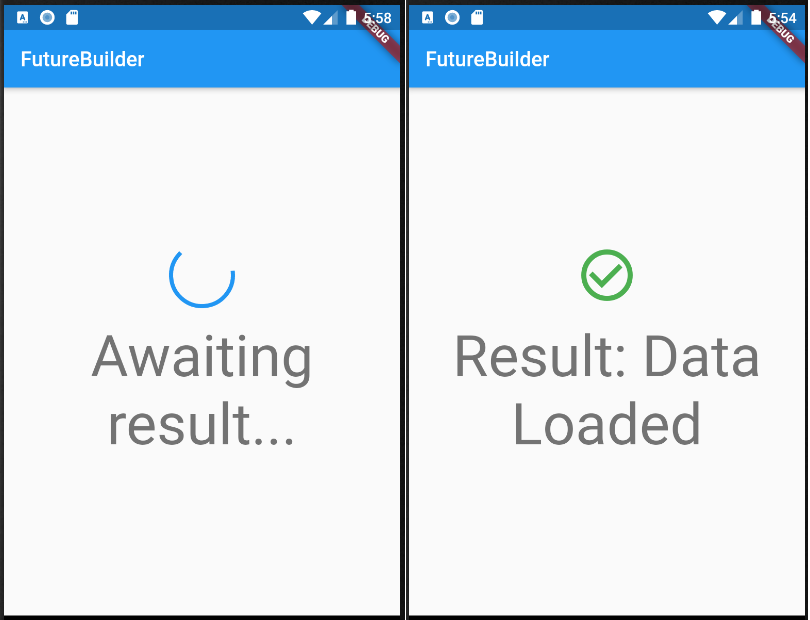

## FutureBuilder sample

This sample shows a FutureBuilder that displays a loading spinner while it loads data. It displays a success icon and text if the Future completes with a result, or an error icon and text if the Future completes with an error. Assume the _calculation field is set by pressing a button elsewhere in the UI.

https://api.flutter.dev/flutter/widgets/FutureBuilder-class.html

https://youtu.be/ek8ZPdWj4Qo

***

